## Developing a Generic Hard Fault handler for ARM Cortex-M3/Cortex-M4

> via: https://blog.feabhas.com/2013/02/developing-a-generic-hard-fault-handler-for-arm-cortex-m3cortex-m4/

*This posting assumes you that you have a working ARM Cortex-M3 base project in Keil uVision*. *If not, please see the “howto” video:* [Creating ARM Cortex-M3 CMSIS Base Project in uVision](http://youtu.be/javTtdybkLQ)

## Divide by zero error

Given the following C function

```
int div(int lho, int rho)
{
    return lho/rho;
}
```

called from main with these arguments

```
int main(void)
{
   int a = 10;
   int b = 0;
   int c;
   c = div(a, b);
   // other code
}
```

You would expect a hardware “divide-by-zero” (*div0*) error. Possibly surprisingly, by default the Cortex-M3 will not report the error but return zero.

### Configuration and Control Register (*CCR*)

To enable hardware reporting of *div0* errors we need to configure the CCR. The CCR is part of the Cortex-M’s System Control Block (*SCB*) and controls entry trapping of divide by zero and unaligned accesses among other things. The CCR bit assignment for *div0* is:

| [4]  | DIV_0_TRP | Enables faulting or halting when the processor executes an `SDIV` or `UDIV` instruction with a divisor of 0:0 = do not trap divide by 01 = trap divide by 0. When this bit is set to 0, a divide by zero returns a quotient of 0. |
| ---- | --------- | ------------------------------------------------------------ |
|      |           |                                                              |

So to enable DIV_0_TRP, we can use CMSIS definitions for the SCB and CCR, as in:

```
SCB->CCR |= 0x10;
```

If we now build and run the project you will need to stop execution as it will appear to run forever. When execution is stopped you’ll find debugger stopped in the file *startup_ARMCM3.s* in the CMSIS default Hard Fault exception handler:

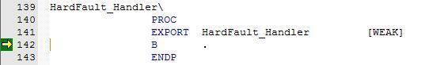

### Override The Default Hard Fault_Handler

As all the exceptions handlers are build with [“Weak” linkage ](https://blog.feabhas.com/2013/01/weak-linkage-in-c-programming/)in CMSIS, it is very easy to create your own Hard Fault handler. Simply define a function with the name “HardFault_Handler”, as in:

```
void HardFault_Handler(void)
{ 
   while(1); 
}
```

``
If we now build, run and then stop the project, we’ll find the debugger will be looping in our new handler rather than the CMSIS default one (alternatively we could put a breakpoint at the while(1) line in the debugger).

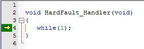

Rather than having to enter breakpoints via your IDE, I like to force the processor to enter debug state automatically if a certain instruction is reached (a sort of debug based *assert*). Inserting the BKPT (breakpoint) ARM instruction in our code will cause the processor to enter debug state. The immediate following the opcode normally doesn’t matter (but always check) except it shouldn’t be 0xAB (which is used for semihosting).

```
#include "ARMCM3.h" 
void HardFault_Handler(void)
{
  __ASM volatile("BKPT #01"); 
  while(1); 
}
```

If we now build and run, the program execution should break automatically at the BKPT instruction.

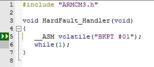

### Error Message Output

The next step in developing the fault handler is the ability to report the fault. One option is, of course, to use *stdio* (stderr) and semihosting. However, as the support for semihosting can vary from compiler to compiler, I prefer to use Instrumented Trace Macrocell (ITM) utilizing the CMSIS wrapper function ITM_SendChar, e.g.

```
void printErrorMsg(const char * errMsg)
{
   while(*errMsg != ''){
      ITM_SendChar(*errMsg);
      ++errMsg;
   }
}
```

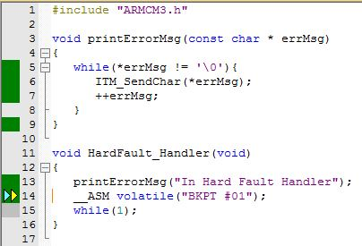

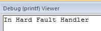

### Fault Reporting

Now that we have a framework for the Hard Fault handler, we can start reporting on the actual fault details. Within the Cortex-M3’s *System Control Block* (SCB) is the *HardFault Status Register* (SCB->HFSR). Luckily again for use, CMSIS has defined symbols allowing us to access these register:

```
void HardFault_Handler(void)
{
   static char msg[80];
   printErrorMsg("In Hard Fault Handler\n");
   sprintf(msg, "SCB->HFSR = 0x%08x\n", SCB->HFSR);
   printErrorMsg(msg);
   __ASM volatile("BKPT #01");
   while(1);
}
```

Building and running the application should now result in the following output:

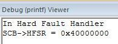

By examining the HFSR bit configuration, we can see that the FORCED bit is set.

**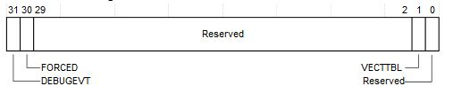**

When this bit is set to 1, the HardFault handler must read the other fault status registers to find the cause of the fault.

### Configurable Fault Status Register (SCB->CFSR)

A forced hard fault may be caused by a bus fault, a memory fault, or as in our case, a usage fault. For brevity, here I am only going to focus on the Usage Fault and cover the Bus and Memory faults in a later posting (as these have additional registers to access for details).

**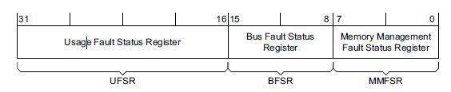**

So given what we know to date, our basic Fault Handler:

- checks if the FORCED bit is set ( if ((SCB->HFSR & (1 << 30)) != 0) )
- prints out the contents of the CFSR

```
void HardFault_Handler(void)
{
   static char msg[80];
   printErrorMsg("In Hard Fault Handler\n");
   sprintf(msg, "SCB->HFSR = 0x%08x\n", SCB->HFSR);
   printErrorMsg(msg);
   if ((SCB->HFSR & (1 << 30)) != 0) {
       printErrorMsg("Forced Hard Fault\n");
       sprintf(msg, "SCB->CFSR = 0x%08x\n", SCB->CFSR );
       printErrorMsg(msg);
   }
   __ASM volatile("BKPT #01");
   while(1);
}
```

Running the application should now result in the following output:

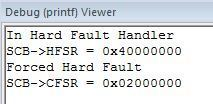

The output indicated that bit 25 of the *UsageFault Status Register* (UFSR) part of the *CFSR* is set.

### **UsageFault Status Register**

The bit configuration of the UFSR is shown below, and unsurprisingly the outpur shows that bit 9 (*DIVBYZERO*) is set.

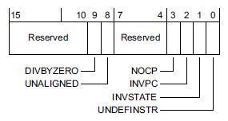

We can now extend the HardFault handler to mask the top half of the CFSR, and if not zero then further report on those flags, as in:

```
void HardFault_Handler(void)
{
   static char msg[80];
   printErrorMsg("In Hard Fault Handler\n");
   sprintf(msg, "SCB->HFSR = 0x%08x\n", SCB->HFSR);
   printErrorMsg(msg);
   if ((SCB->HFSR & (1 << 30)) != 0) {
       printErrorMsg("Forced Hard Fault\n");
       sprintf(msg, "SCB->CFSR = 0x%08x\n", SCB->CFSR );
       printErrorMsg(msg);
       if((SCB->CFSR & 0xFFFF0000) != 0) {
         printUsageErrorMsg(SCB->CFSR);
      }
   }
   __ASM volatile("BKPT #01");
   while(1);
}
void printUsageErrorMsg(uint32_t CFSRValue)
{
   printErrorMsg("Usage fault: ");
   CFSRValue >>= 16;                  // right shift to lsb
   if((CFSRValue & (1 << 9)) != 0) {
      printErrorMsg("Divide by zero\n");
   }
}
```

A run should now result in the following output:

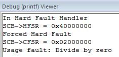

### Register dump

One final thing we can do as part of any fault handler is to dump out known register contents as they were at the time of the exception. One really useful feature of the Cortex-M architecture is that a core set of registers are automatically stacked (by the hardware) as part of the exception handling mechanism. The set of stacked registers is shown below:

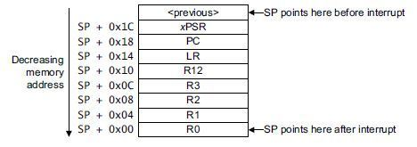

Using this knowledge in conjunction with [AAPCS](http://infocenter.arm.com/help/topic/com.arm.doc.ihi0042e/IHI0042E_aapcs.pdf) we can get access to these register values. First we modify our original HardFault handler by:

- modifying it’s name to “Hard**_**Fault_Handler”

- adding a parameter declared as an array of 32–bit unsigned integers.

```
void Hard_Fault_Handler(uint32_t stack[])
```

Based on AAPCS rules, we know that the parameter label (*stack*) will map onto register r0. We now implement the actual HardFault_Handler. This function simply copies the current Main Stack Pointer (MSP) into r0 and then branches to our Hard_Fault_Handler (this is based on ARM/Keil syntax):

```
__asm void HardFault_Handler(void) 
{
  MRS r0, MSP
  B __cpp(Hard_Fault_Handler) 
}
```

Finally we implement a function to dump the stack values based on their relative offset, e.g.

```
enum { r0, r1, r2, r3, r12, lr, pc, psr};

void stackDump(uint32_t stack[])
{
   static char msg[80];
   sprintf(msg, "r0  = 0x%08x\n", stack[r0]);  printErrorMsg(msg);
   sprintf(msg, "r1  = 0x%08x\n", stack[r1]);  printErrorMsg(msg);
   sprintf(msg, "r2  = 0x%08x\n", stack[r2]);  printErrorMsg(msg);
   sprintf(msg, "r3  = 0x%08x\n", stack[r3]);  printErrorMsg(msg);
   sprintf(msg, "r12 = 0x%08x\n", stack[r12]); printErrorMsg(msg);
   sprintf(msg, "lr  = 0x%08x\n", stack[lr]);  printErrorMsg(msg);
   sprintf(msg, "pc  = 0x%08x\n", stack[pc]);  printErrorMsg(msg);
   sprintf(msg, "psr = 0x%08x\n", stack[psr]); printErrorMsg(msg);
}
```

This function can then be called from the Fault handler, passing through the stack argument. Running the program should result is the following output:

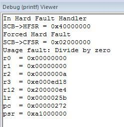

Examining the output, we can see that the program counter (pc) is reported as being the value 0x00000272, giving us the opcode generating the fault. If we disassemble the image using the command:

fromelf -c CM3_Fault_Handler.axf —output listing.txt

By trawling through the listing (*listing.txt*) we can see the SDIV instruction at offending line (note also r2 contains 10 and r1 the offending 0).

```
.text
div
0x00000270: 4602          MOV r2,r0
0x00000272: fb92f0f1      SDIV r0,r2,r1
0x00000276: 4770          BX lr
.text
```

Finally, if you’re going to use the privilege/non–privilege model, you’ll need to modify the HardFault_Handler to detect whether the exception happened in Thread mode or Handler mode. This can be achieved by checking bit 3 of the HardFault_Handler’s Link Register (lr) value. Bit 3 determines whether on return from the exception, the Main Stack Pointer (MSP) or Process Stack Pointer (PSP) is used.
``

```
__asm void HardFault_Handler(void)
{
  TST lr, #4     // Test for MSP or PSP
  ITE EQ
  MRSEQ r0, MSP
  MRSNE r0, PSP
  B __cpp(Hard_Fault_Handler)
}
```

In a later post I shall develop specific handler for all three faults.

Notes:

1. The initial model for fault handling can be found in Joseph Yiu’s excellent book “[The Definitive Guide to the ARM Cortex-M3](http://www.amazon.co.uk/Definitive-Guide-ARM-Cortex-M3/dp/185617963X)”
2. The code shown was built using the ARM/Keil MDK-ARM Version 4.60 development environment (a 32Kb size limited evaluation is available from the Keil website)
3. The code, deliberately, has not been refactored to remove the hard-coded (magic) values.
4. Code available on GitHub at [git://github.com/feabhas/CM3_Fault_Handler.git](https://github.com/feabhas/CM3_Fault_Handler.git)