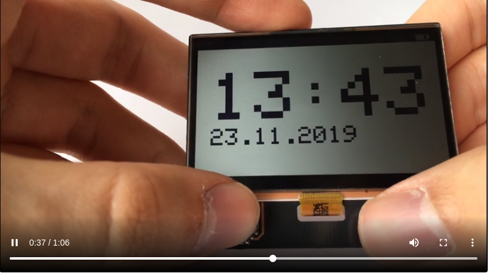
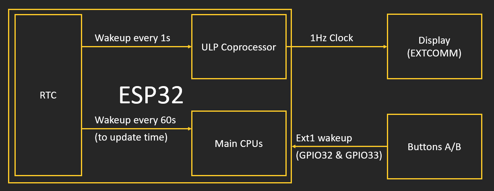

# 常亮仅300µW功耗，基于ESP32的低功耗显示屏DIY

> via: https://www.cirmall.com/articles/32024

该手持板由ESP32供电，并具有透反射式的夏普LCD控制器。
与我以前的Chronio智能手表类似，该项目的重点是低功耗。
使用ESP32的ULP内核，开发板可以进入有源显示器的深度睡眠。
该软件包括带有简单RSS阅读器的菜单界面。

一些主要特点是：
\- 400x240px 2.7" SHARP存储器显示
\- 350毫安锂聚合物电池与USB充电
\- 300μW功耗一直显示
\- 4向操纵杆和按钮
-日期和时间使用内置的RTC与NTP同步

 

1×夏普LS027B7DH01A
1×ESP32开发板
1×350 mAh 3.7V锂电

 

虽然电池只能为掌上电脑供电几小时，但我想提供一种利用低功耗显示屏的待机模式。这样，该设备将可用作时钟和日历。要使显示器保持活动状态并延长电池寿命，需要做一些事情。尽管存储器显示不需要通过SPI进行持续刷新，但必须向其EXTCOMM引脚提供> 1Hz的时钟信号。否则，屏幕显示老化。这意味着ESP32的一部分需要在待机模式下保持活动状态。

ESP32的双核和WiFi调制解调器在70-200mA时可能会耗电。但并非所有人都知道它具有一些不错的省电功能。在睡眠模式下，ESP32的主要内核都处于掉电状态，从而将电流降至10µA。在此期间，内部实时时钟控制器仍处于活动状态。RTC本身并不能做很多事，但它可以唤醒ESP32的第三核ULP协处理器。这款超低功耗处理器可以执行基本任务，例如检查传感器或读取和写入引脚状态，而仅需约150µA。正是1Hz信号所需要的。RTC可以使用以下命令定期唤醒ULP：

ulp_set_wakeup_period（0，1000 * 1000）;

对于1Hz信号，必须在汇编器中对ULP协处理器进行编程。幸运的是，Espressif有一个LED闪烁的示例，它确实可以实现我想要的功能：

ESP32可以由不同的唤醒源激活。对于该项目，需要GPIO中断，因为只需按一下按钮即可唤醒设备。两次外部唤醒是ext0和ext1。ext0只能分配给一个引脚，而ext1可以分配给不同引脚的映射。使用ULP内核时，需要考虑以下几点：仅可以使用RTC可以访问的引脚（RTC GPIO）。我还发现内部上拉/下拉设置不可靠。我在设计中使用了硬件下拉菜单。

//通过GPIO32和GPIO33上的按钮唤醒ESP32 
＃define BUTTON_PIN_BITMASK 0x300000000 
esp_sleep_enable_ext1_wakeup（BUTTON_PIN_BITMASK，ESP_EXT1_WAKEUP_ANY_HIGH）;

我想每隔一分钟更新一次时间。短时间内不唤醒ESP32是无法做到的：

esp_sleep_enable_timer_wakeup（（60 -now .tm_sec）* 1000000）;

在配置了待机模式的情况下，当唤醒ULP或主内核时，ES32仅在短尖峰时消耗几微安。但是板上的其他组件也需要供电。显示器本身又消耗了10µA的电流，但也需要5V的电源。由于LiPo电池的电压仅为3.7V，因此需要DC-DC转换器。经过一番搜索后，我找到了Microchip的MCP1640。这是一款升压稳压器，静态电流仅为19µA。IC很小，只需要几个外部零件。ESP32的3.3V电源是一个更大的问题。事实证明，很难找到一种具有高输出电流但静态电流小的稳压器，并且该稳压器也可以手工焊接。我最后得到的是AP2112K，它可以在55µA的静态电流下提供600mA的电流。 

一旦有了实际的PCB，测试实际功耗也很棘手。大多数万用表的µA范围的分流电阻太大，无法为ESP32供电。不断地在范围之间切换或交换电线是很乏味的。一个使用stackexchange的用户想出了一个聪明的解决方案

当电流高时，与万用表并联的二极管将限制电压降。在睡眠模式下，二极管几乎不让电流通过。这样，我可以使用万用表方便地测量睡眠模式下的功耗。 

ESP32处于睡眠模式时，电流约为97µA。59µA是由3.3V电源引起的