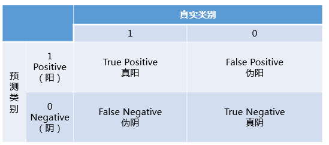
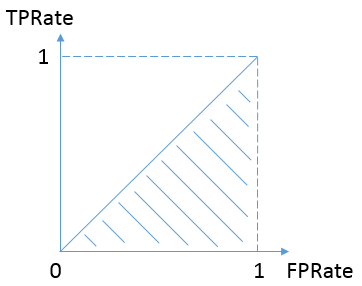
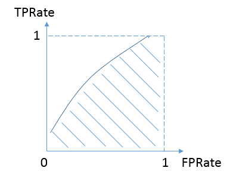
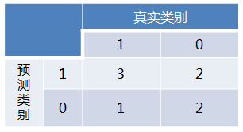
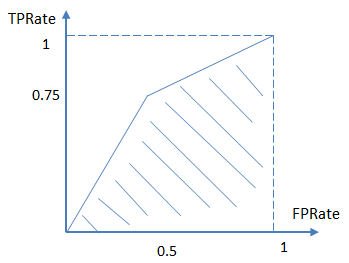

## 机器学习中的AUC

作者：无涯
链接：https://www.zhihu.com/question/39840928/answer/241440370
来源：知乎
著作权归作者所有。商业转载请联系作者获得授权，非商业转载请注明出处。

之前各位的回答从各个角度解释了AUC的意义和计算方法，但是由于本人实在愚钝，一直没能参透AUC的意义和计算方法之间的联系，直到刚才突然有所顿悟，本着尽量言简意赅、浅显易懂的原则，在这里记录一下。

**首先**，在试图弄懂AUC和ROC曲线之前，一定，一定要彻底理解**混淆矩阵**的定义！！！

混淆矩阵中有着Positive、Negative、True、False的概念，其意义如下：

- **称预测类别为1的为Positive（阳性），预测类别为0的为Negative（阴性）。**
- **预测正确的为True（真），预测错误的为False（伪）。**

对上述概念进行组合，就产生了如下的混淆矩阵：

**然后**，由此引出True Positive Rate（真阳率）、False Positive（伪阳率）两个概念：

- ![[公式]](_assets/机器学习中的AUC/equation)
- ![[公式]](_assets/机器学习中的AUC/equation)

仔细看这两个公式，发现其实TPRate就是TP除以TP所在的列，FPRate就是FP除以FP所在的列，二者意义如下：

- **TPRate的意义是所有真实类别为1的样本中，预测类别为1的比例。**
- **FPRate的意义是所有真实类别为0的样本中，预测类别为1的比例。**

------

如果上述概念都弄懂了，那么ROC曲线和AUC就so easy了：

按照定义，AUC即ROC曲线下的面积，而ROC曲线的横轴是FPRate，纵轴是TPRate，当二者相等时，即y=x，如下图:

表示的意义是：对于不论真实类别是1还是0的样本，分类器预测为1的概率是相等的。

换句话说，分类器对于正例和负例毫无区分能力，和**抛硬币**没什么区别，一个抛硬币的分类器是我们能想象的最差的情况，因此一般来说我们认为AUC的最小值为0.5（当然也存在预测相反这种极端的情况，AUC小于0.5，这种情况相当于分类器**总是**把对的说成错的，错的认为是对的，那么只要把预测类别取反，便得到了一个AUC大于0.5的分类器）。

而我们希望分类器达到的效果是：对于真实类别为1的样本，分类器预测为1的概率（即TPRate），要大于真实类别为0而预测类别为1的概率（即FPRate），即y＞x，因此大部分的ROC曲线长成下面这个样子：

最理想的情况下，既没有真实类别为1而错分为0的样本——TPRate一直为1，也没有真实类别为0而错分为1的样本——FP rate一直为0，AUC为1，这便是AUC的极大值。

------

说了这么多还是不够直观，不妨举个简单的例子。

首先对于硬分类器（例如SVM，NB），预测类别为离散标签，对于8个样本的预测情况如下：

得到混淆矩阵如下：

进而算得TPRate=3/4，FPRate=2/4，得到ROC曲线：

最终得到AUC为0.625。

对于LR等预测类别为概率的分类器，依然用上述例子，假设预测结果如下：

这时，需要设置阈值来得到混淆矩阵，不同的阈值会影响得到的TPRate，FPRate，如果阈值取0.5，小于0.5的为0，否则为1，那么我们就得到了与之前一样的混淆矩阵。其他的阈值就不再啰嗦了。依次使用所有预测值作为阈值，得到一系列TPRate，FPRate，描点，求面积，即可得到AUC。

------

最后说说AUC的优势，AUC的计算方法同时考虑了分类器对于正例和负例的分类能力，在样本不平衡的情况下，依然能够对分类器作出合理的评价。

例如在反欺诈场景，设欺诈类样本为正例，正例占比很少（假设0.1%），如果使用准确率评估，把所有的样本预测为负例，便可以获得**99.9%的准确率**。

但是如果使用AUC，把所有样本预测为负例，TPRate和FPRate同时为0（没有Positive），与(0,0) (1,1)连接，得出**AUC仅为0.5**，成功规避了样本不均匀带来的问题。